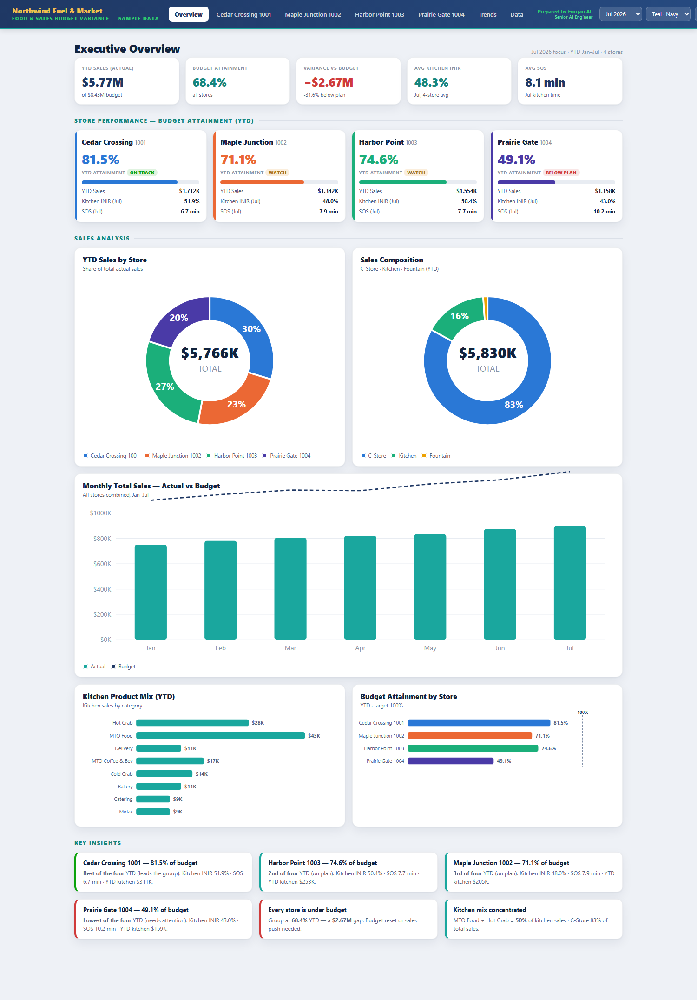
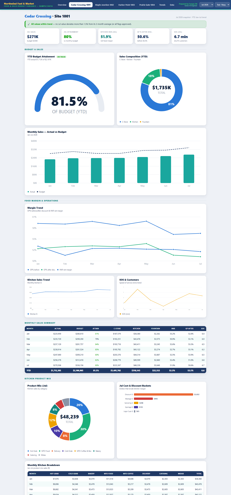
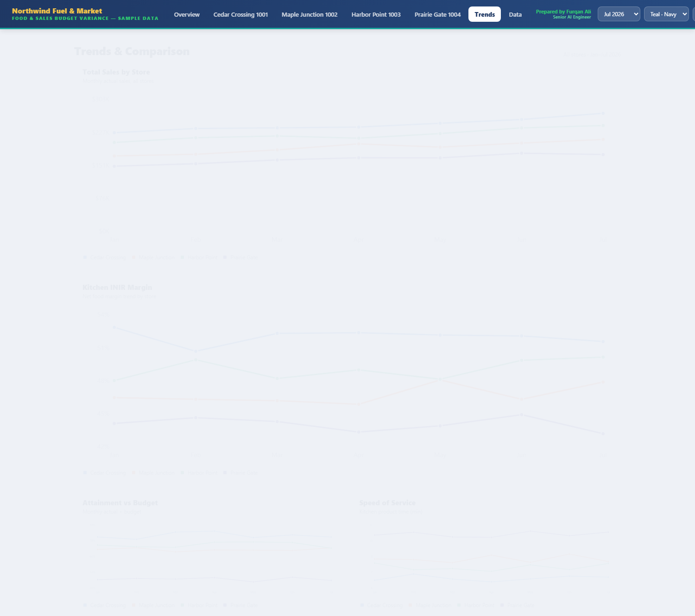
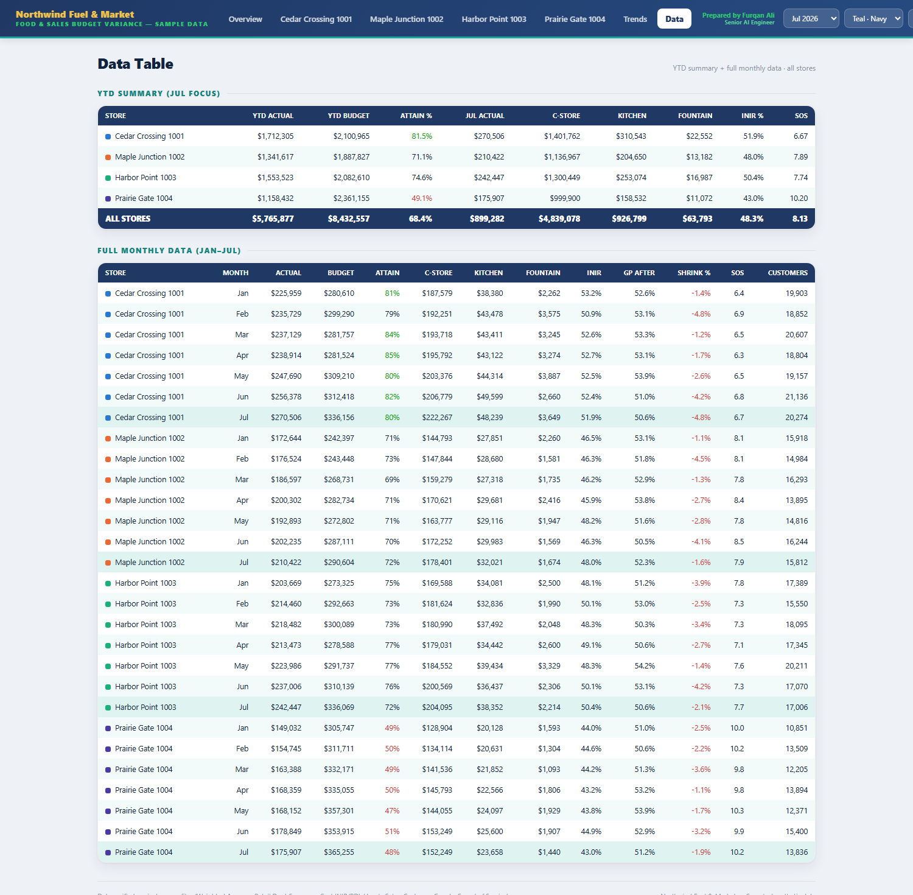
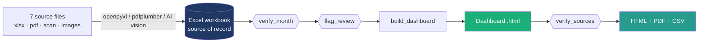

<div align="center">

# 🍔⛽ Food &amp; Sales Budget Variance — Executive Dashboard &amp; Automation

**Turn 7 messy monthly source files — spreadsheets, a scanned PDF, and phone screenshots —
into one verified workbook and a self-contained, director-ready dashboard. In one command.**

[](https://furqunali.github.io/food-sales-variance-automation/)
[](https://github.com/furqunali/food-sales-variance-automation/actions/workflows/ci.yml)
[](LICENSE)


**[▶ Open the live interactive demo](https://furqunali.github.io/food-sales-variance-automation/)** &nbsp;·&nbsp; no data or install required

</div>

---

## What it is

A monthly reporting pipeline for a **four-store food-and-fuel operation**. It ingests seven
heterogeneous source files, **verifies every number three different ways**, and regenerates a
single self-contained HTML dashboard that leadership can open offline, filter by month, and
print to a two-page PDF.

The interesting part isn't the charts — it's the **chain of trust**. Three of the seven
sources aren't machine-readable (a *scanned* image PDF and two screenshots), so the pipeline
uses **AI vision** for those and deterministic Python for everything else, then cross-checks
the finished dashboard back against the original documents.

> 🔒 **All data in this repo is synthetic.** It was built for a real operation; the real
> workbook and source documents are confidential and are **not** included. Everything you see
> in the demo is generated by [`sample/generate_sample.py`](sample/generate_sample.py) for four
> fictional stores.

## ✨ Highlights

- **Multi-modal ingestion** — structured `.xlsx`, a digital PDF, a **scanned image PDF**, and
  screenshots, each read the right way (openpyxl / pdfplumber / AI vision).
- **Three verification gates** — internal consistency, 3-month trend deviation, and a
  source-document cross-check — before anything ships.
- **Self-contained dashboard** — inline SVG charts + vanilla JS, **no CDN, no build step**;
  works fully offline, prints cleanly, exports CSV.
- **7 tabs** — Overview + one per store + Trends + a full data grid; **month selector**,
  **5 themes + dark mode**.
- **Auto-detects the latest month** — next month "just works," no code changes.
- **Runnable in 5 seconds** — `python sample/generate_sample.py`, zero dependencies.

## 🖼️ Gallery

> Rendered from the synthetic demo dataset.

### Executive overview


### Per-store detail (Excel-level depth)


<table>
<tr>
<td width="50%"><b>Trends</b><br></td>
<td width="50%"><b>Full data grid</b><br></td>
</tr>
</table>

## 🚀 Try it locally

```bash
git clone https://github.com/furqunali/food-sales-variance-automation.git
cd food-sales-variance-automation

python sample/generate_sample.py     # builds demo/dashboard-demo.html (no deps)
# then open demo/dashboard-demo.html in any browser
```

That's it — the demo generator uses only the Python standard library.

## 🏗️ How it works



Full write-up: **[docs/ARCHITECTURE.md](docs/ARCHITECTURE.md)** ·
verification: **[docs/METHODOLOGY.md](docs/METHODOLOGY.md)** ·
the story: **[docs/CASE_STUDY.md](docs/CASE_STUDY.md)**.

## 📁 Repository layout

```
food-sales-variance-automation/
├── src/                     Production pipeline (runs against the private workbook)
│   ├── build_dashboard.py       extract verified figures -> inject into template
│   ├── verify_month.py          consistency + month-over-month checks
│   ├── flag_review.py           3-month-average deviation flags + approvals
│   ├── verify_sources.py        dashboard <-> workbook <-> source cross-check
│   ├── dashboard_template.html  the dashboard shell (4 JSON placeholders)
│   └── FIELD_SOURCE_CELL_MAP.md every field -> its source -> its cell
├── sample/
│   ├── generate_sample.py       build a runnable demo from synthetic data
│   └── sample_data.json         the generated synthetic dataset
├── demo/dashboard-demo.html     the built demo (also served on GitHub Pages)
├── docs/                        architecture · methodology · case study · script · assets
├── .github/workflows/           CI + Pages deploy
└── requirements.txt             deps for the PRODUCTION pipeline only
```

## 🔧 Production pipeline (with a real workbook)

The `src/` scripts are the real pipeline. They expect a monthly Excel workbook (kept private,
under `data/`) and run in sequence:

```bash
pip install -r requirements.txt
python src/verify_month.py       # consistency + MoM swings for the latest month
python src/flag_review.py        # trend-deviation flags -> review -> --approve all
python src/build_dashboard.py    # rebuild the dashboard from the workbook
python src/verify_sources.py     # cross-check dashboard <-> workbook <-> sources
```

The workbook itself is written with **Excel COM** (it holds charts, drawings, and embedded
images that `openpyxl` would destroy); `openpyxl` is used read-only here.

## 🧰 Tech

**Python** (openpyxl, pdfplumber, stdlib) · **AI vision** for scanned/image sources ·
**vanilla JS + inline SVG** dashboard (no framework, no CDN) · **GitHub Actions** for CI and
Pages.

## 📜 License

[MIT](LICENSE) © 2026 Furqan Ali — *Senior AI Engineer*
