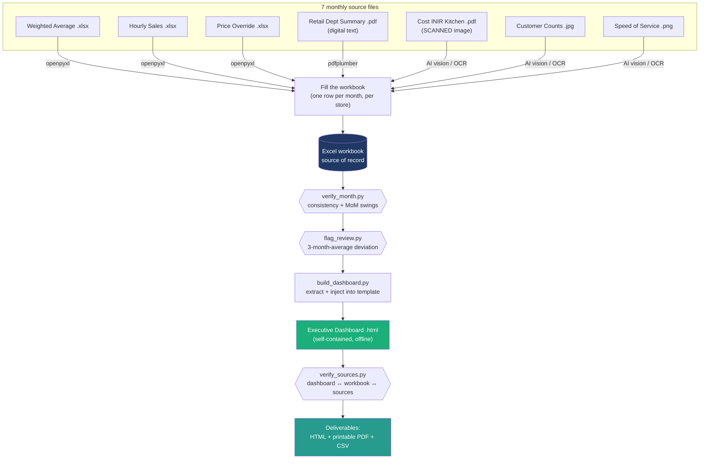

# Architecture

The system turns **7 heterogeneous monthly source files** — structured spreadsheets,
a digital PDF, a *scanned* image PDF, and phone screenshots — into one verified
workbook and one self-contained executive dashboard, with verification gates at every
step.

## Data flow

## Why an AI agent, not just a script

Four of the seven sources are structured (spreadsheets + one digital PDF) and are read
deterministically with `openpyxl` / `pdfplumber`. **Three are not machine-readable**: the
Cost INIR kitchen report is a *scanned image* PDF (no text layer), and the customer-count
and speed-of-service files are screenshots. Those require **AI vision** to read reliably.
This hybrid — vision for the unstructured inputs, deterministic Python for verification and
rendering — is the core design decision.

## Components

| Layer | File | Responsibility |
|---|---|---|
| **Fill** | (AI agent + human) | Read all 7 sources, write the month into the workbook |
| **Verify** | `src/verify_month.py` | Internal consistency (Total = C-Store + Kitchen) + MoM swings |
| **Flag** | `src/flag_review.py` | Flag values >1.5% off their trailing 3-month average |
| **Build** | `src/build_dashboard.py` | Extract verified figures, inject into `dashboard_template.html` |
| **Cross-check** | `src/verify_sources.py` | Re-confirm dashboard ↔ workbook ↔ original sources |
| **Template** | `src/dashboard_template.html` | The dashboard shell (4 placeholders, inline SVG + JS) |
| **Demo** | `sample/generate_sample.py` | Build a runnable dashboard from synthetic data (no workbook) |

## The template contract

`build_dashboard.py` (and the demo generator) inject four JSON payloads into the template:

| Placeholder | Contents |
|---|---|
| `__MONTHLY__` | `{ storeId: [ {month, sales, margin, kitchen mix, …} ] }` |
| `__EXTRA__` | `{ storeId: { inv: [...], override: [...] } }` |
| `__MONS__` | `["Jan", …, latest]` — auto-detected from the workbook |
| `__FLAGS__` | `{ storeId: { metric: note } }` — pending review flags |

Because the dashboard is **regenerated from the workbook**, it can never silently drift
from the numbers. Every build re-runs the integrity check and prints the group YTD total.

## Design constraints (learned in production)

- **Write the workbook with Excel COM, never `openpyxl`** — it contains charts, drawings,
  and embedded images that `openpyxl` would strip. `openpyxl` is read-only here.
- **The dashboard is one self-contained file** — inline SVG charts + vanilla JS, no CDN,
  so it works offline and prints cleanly. No build step, no framework.
- **Auto-detect the latest filled month** — next month "just works" with no code change.
